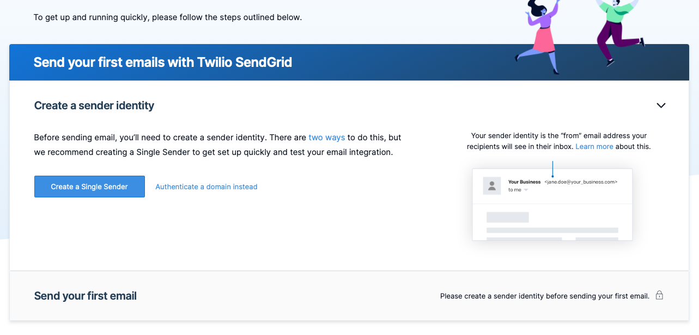
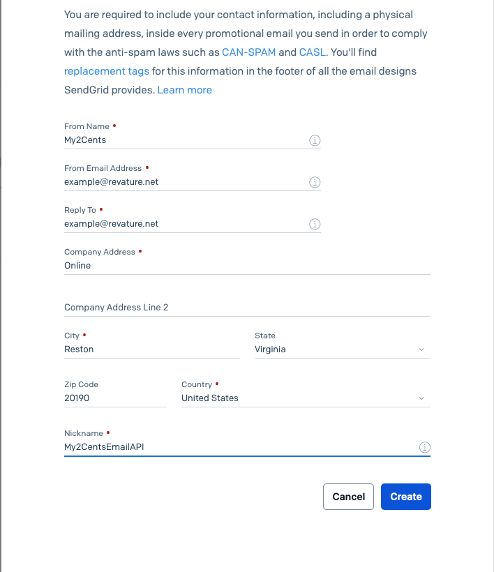
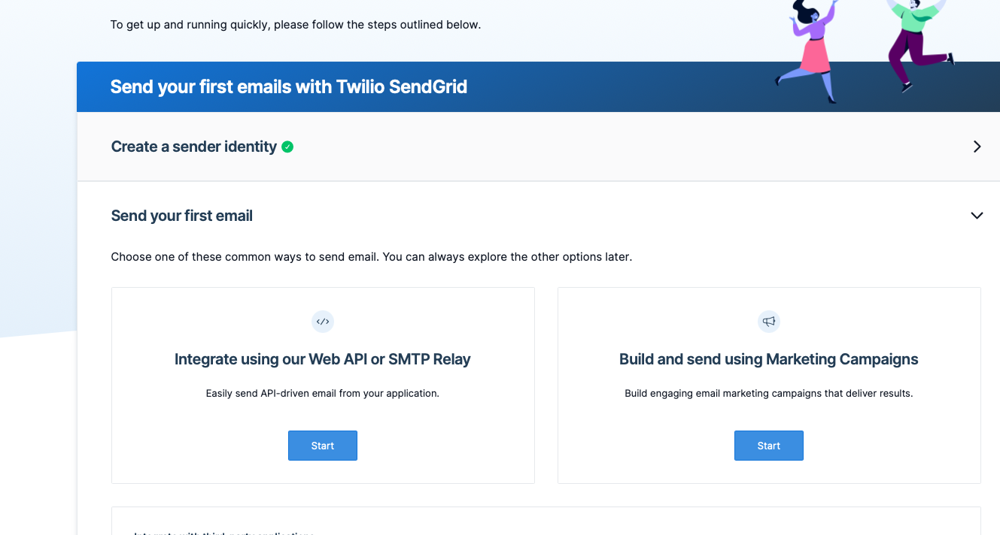
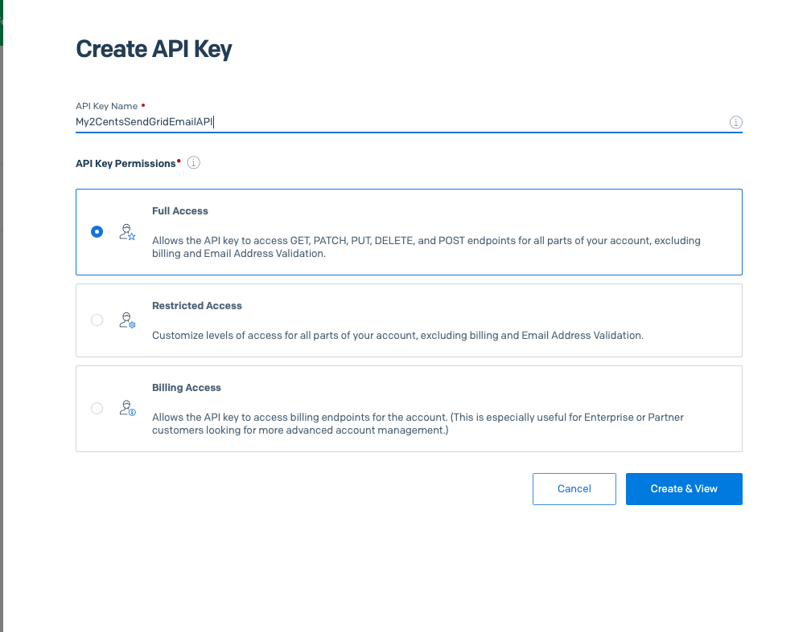

# Setting Up for My2Cents Application
> (v2.0.0)

Please make sure that you follow all the steps below to make the app be able to run as it is in the <code>LOCALHOST</code>. If you want to run it in cloud, please make sure to add the configurations for the App Keys and ConnectionString. 

All steps here are required to add new information to the "appsettings.json" file which you should create in the API folder.

# Table of Contents
- [Setting Up for My2Cents Application](#setting-up-for-my2cents-application)
- [Table of Contents](#table-of-contents)
- [SendGrid:](#sendgrid)
  - [Create SendGrid Account For Sending Email](#create-sendgrid-account-for-sending-email)
  - [Setup](#setup)
- [Access Token For APIs](#access-token-for-apis)
- [ConnectionString](#connectionstring)

# SendGrid:
## Create SendGrid Account For Sending Email
Please access to this website [SendGrid](https://sendgrid.com).


You can start with the Free plan(in our application we are using the Free plan) or register with the other plans.

After created the account. You will need to fill out all the other information as requirement from SendGrid

From here, you can start Create a new Single Sender


Fill out all the information, please make sure that the <code>From Email Address</code> is the Email Address that you will use to send email. Save this email address for the Setup step.


And make sure to verify your email.

When you done verification step. You should be in the same step below here.


On the left sidebar, go to "Settings/API Keys"
Here, press "Create API Key" and fill out the API Key Name


And press "Create".
Please save this API Key.

## Setup
In the <code>appsettings.json</code> file, please add these lines below:
```json
"SendGrid": {
    "My2CentsSendGridEmailAPI": "yourSendGridAPIKey",
    "EmailAddress": "yourEmailRegisteredInSendGrid"
}
```

# Access Token For APIs
In the <code>appsettings.json</code> file, please add these lines below:
```json
"Token": {
    "Key": "youCanPutAnyThingHere"
}
```

# ConnectionString
In the <code>appsettings.json</code> file, please add these lines below:
```json
"ConnectionStrings": {
    "connectionString": "yourConnectionStringToDatabase"
}
```
In our project, we used SQL Server, if you want to use another database, please change the setting in the <code>Program.cs</code> file too.
